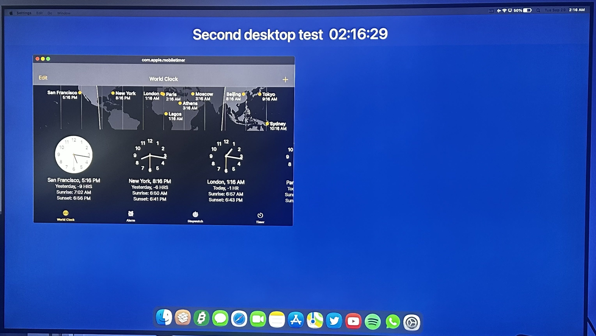

# Changelog

All notable changes to MacStatusBar&Dock. Install or update from the Sileo repo: https://besiktasliseba.github.io/repo/

## 1.1.9

### Fixes
- Esc ends typing in windows works on iPadOS 16 again. iPadOS 16 gives every app a system Esc shortcut of its own, and the tweak took that as the app using Esc, so Esc no longer put the text cursor away. Esc shortcuts that belong to the app still come first, like cancelling a search in Notes.
- Globe volume keys (Globe + Option / Control) now work on iPadOS 15 too. They only worked on iPadOS 16.

## 1.1.8

### New
- Dock: the Downloads stack has a search field under "Downloads From…". Type to filter your downloads by name as you go (letter case and accents don't matter). Return opens the first result, and Esc clears the field or closes the stack.
- Apple menu: "Update Available (version)…" appears under About This iPad when a newer MacStatusBar&Dock is waiting in Sileo or Zebra, and opens its page there. It only reads the package list your package manager already downloaded; the tweak itself never goes online.

### Fixes
- App menu > Share… works in apps whose Share button sits in a toolbar, like Notes: it now opens the app's own share options (Notes offers the note as a PDF, for example). If an app has no Share button, a share sheet for what's on screen opens instead of nothing.

## 1.1.7

### Improvements
- Stage Manager engine, Fit to Window: when a third app is added to two tiled windows, you now pick where it goes before it opens. Before, it could open behind the two windows while the question was up.
- Stage Manager engine: windows keep their layout when you turn the iPad. A window in a half or quarter goes to the same place in the new orientation, and any other window is kept inside the screen, so its title bar can't end up out of reach.
- Stage Manager engine: an iPadOS 17 version, experimental and not tested on a device yet. On iPadOS 17 the tweak stays off until you turn on Enable Anyway, and the engine is only offered where its startup check passes. Report a Problem includes what it found, so reports from iPadOS 17 help a lot.

### Fixes
- Stage Manager engine: with our resize handles, the bottom-left corner resizes the window with a finger too, not only the bottom-right one.

## 1.1.6

### New
- Dock: "Remove from Dock" in the Haptic Touch menu of apps kept in the Dock, like on a Mac. The app moves to the first free spot on the Home Screen, so you can edit the Dock while windows cover the Home Screen.

### Improvements
- Windows follow the Dock. When you add or remove Dock apps, or change the Dock's size or its gap to the screen edge, windows move to the new Dock line right away. A window filling the desktop or sitting in a half or quarter keeps its layout, without a respring.
- Stage Manager engine (experimental): it now needs iPadOS 16.1 or later. On iPadOS 16.0 Apple has Stage Manager switched off, and turned on by hand it differs too much for the engine (#2).
- Stage Manager engine: it's only offered once its startup check has passed on your iPadOS version. The check now also runs when you use the stock status bar, and Report a Problem includes its result.

### Fixes
- Stage Manager engine: a newly opened app no longer comes up with its title bar and traffic lights under the menu bar when the Dock is showing.

## 1.1.5

### Fixes
- Dock: Gap to Screen Edge now works on iPadOS 16, and the Dock moves as soon as you change it, without a respring.
- Audio menu: per-app volume now works for Twitch and other apps built on the same video player, like Kick (#3). Their sound goes through a different part of iOS than most apps, which the volume slider didn't reach before.

## 1.1.4

### Improvements
- Stage Manager engine (experimental): safer on iPadOS versions it hasn't been tested on. At startup it checks everything it needs from iPadOS; if anything is missing or different, it stays off, the default engine runs instead, and Settings > Status Bar > Window Engine shows it as "Not Supported Yet" with the reason, instead of SpringBoard crashing.
- Stage Manager engine: app launches are only changed when every step checks out; otherwise iPadOS's own launch runs untouched.
- Stage Manager engine: Stage Manager is no longer switched on during startup, and follows Apple's own first-time path.
- The Window Engine picker marks Stage Manager as "Experimental".

### Fixes
- Stage Manager engine, Fit to Window: a window coming back from full screen takes its tile again instead of being asked about as a new third window.

## 1.1.3

### Changes
- Aerial 5.0 is the recommended window engine on every iPad again. New installs no longer start with the Stage Manager engine; it stays available in Settings > Status Bar > Window Engine. It's tested on iPadOS 16.7.7 and may not work yet on earlier iPadOS 16 versions.

### Improvements
- Stage Manager engine: Fit to Window asks where a third window goes (left, right or No Fit), like the other engines, and keeps the arrangement you choose, also when the iPad is turned.

## 1.1.2

### Fixes
- Stage Manager engine: touching a window behind another one brings it to the front when you lift your finger. This was missing from 1.1.0 and 1.1.1, so a scroll or tap in a background window left the other window active.
- Stage Manager engine: pressing the red or yellow button on a window behind another one no longer brings it straight back.
- Stage Manager engine: typing on the on-screen keyboard over another window no longer brings that window to the front.
- Stage Manager engine: with a hardware keyboard, a floating or a split keyboard, the Dock no longer hides as if the full keyboard were up.
- Stage Manager engine: Fit to Window tiles the windows again when the iPad is turned.
- Stage Manager engine: Bring All to Front and Send All to Back move every window at once.
- Stage Manager engine: a window leaving full screen comes back in front.
- Stage Manager engine: swiping up to the Home Screen or using the App Switcher over a window no longer brings that window back.

## 1.1.1

### Fixes
- Stage Manager engine: full-screen apps (Safari and others) were drawn shorter than the screen, with their top cut off.
- Stage Manager engine: typing in a window could make the keyboard close again and again.
- Stage Manager engine: with Open Apps as Windows on, an app opened from the Home Screen onto an empty desktop opens as a window again, instead of coming back full screen.
- Stage Manager engine with an external display: the Window menu's swap rows and layouts work on the active window's own screen, and new windows on the display are placed within the display's desktop.
- Mac pointer: Use Pointer Control Style follows Pointer Control's Color when it's set to None.

## 1.1.0

### New
- **Stage Manager window engine (iPadOS 16).** Pick Stage Manager in Settings > Status Bar > Window Engine, and iPadOS's own Stage Manager runs your windows with a Mac look: title bars with traffic lights, native full screen, the Window menu and resize handles. It works on iPads with Stage Manager, and on older iPads with TrollPad. It's the recommended engine where it's available, and new installs on those iPads start with it.
  - Windows open on the desktop together, from the Home Screen, the Dock, Spotlight, notifications, links and our menus. A fifth window minimizes only the oldest one.
  - Full screen stays on the desktop: other windows can come in front of or behind a full-screen app, as with the other engines. The green button toggles back to the window.
  - Window menu: layouts, Fit to Window, Swap rows, Minimize All, Bring All to Front / Send All to Back, and Move to Other Display.
  - Resize Handles: choose ours or Stage Manager's, and tint either one.
  - A window in the background comes forward when you lift your finger, so scrolling in it doesn't turn into a tap.
- **External display with the Stage Manager engine (iPadOS 16).** The external display gets its own Mac desktop, with a menu bar, Dock and wallpaper. See "External display" below for what it can and can't do yet.
- **Traffic lights everywhere:** grey on inactive windows, with symbols on hover or press, for every window engine.
- **Use Pointer Control Style** (Settings > Pointer): the Mac pointer can take the Color, Border Width and Increase Contrast from Accessibility > Pointer Control. It's off by default, so the pointer starts as the classic black-and-white arrow.
- One-time notice after updating on iPadOS 16: Stage Manager is now a window engine, with a button that opens the Window Engine picker. iPads without Stage Manager get a note that TrollPad turns it on.

### Improvements
- Resize handles start untinted. Turn on Tint Resize Handles in Settings > Status Bar to give them each app's color; if you had already switched it on yourself, it stays on.
- The traffic lights look up the active app once per change instead of on every frame.

### Fixes
- With an external display, the Mac pointer no longer stays behind on the iPad's menu bar after the pointer moves to the other screen, and it points the right way after the iPad is turned.

### External display (iPadOS 16, Stage Manager engine)
Works:
- Its own desktop: menu bar (Apple menu, app menus, status items), Dock, wallpaper.
- Windows with title bars and traffic lights; the front window on the display drives its menu bar.
- Window > Move to Other Display, in both directions.
- Window menu layouts use that display's own size, above its Dock.
- Full screen on the display (its Dock hides), independent of the iPad.
- Apps opened from the display's Dock open there.

Doesn't work yet:
- Opening an app from the display's Dock brings that app's whole group of windows to the display (Stage Manager's own rule).
- After a respring, windows on the display come back only when they're opened again.
- A window moved to the other screen keeps its size relative to the screen it came from.
- The Window menu doesn't check-mark the current layout for windows on the display.
- Up to 4 windows per desktop (Stage Manager).
- Tested with a wired display (Lightning to HDMI); AirPlay is untested.

### In the works

- A second desktop on external displays for iPadOS 15. An early version already runs its own menu bar, Dock and apps on the TV, separate from the iPad. It isn't in this update: it still has to handle the pointer on the TV.

## 1.0.10

### New
- VPN menu in the status bar: while a VPN is connected, iOS's own VPN badge shows as its own item next to the status icons, like the VPN menu on a Mac. Its menu shows the VPN's name, Disconnect (auto-connect is turned off too, so it stays off), a button that opens the VPN's app and VPN & Device Management.
- Respring warning with Aerial 5.0: Aerial 5.0 goes online while SpringBoard starts, and with a VPN on (or just turned off) that can hang on a black screen. Resprings now warn first (the Apple menu, Settings, Control Center toggles and package managers that use iOS's standard respring), with VPN Settings, Respring Anyway and Cancel.
- Haptic Touch Menus: choose Mac or Stock in Settings > Status Bar > App Menus. Mac menus have slimmer rows and adapt to a trackpad or mouse.

### Improvements
- Dock and Home Screen Haptic Touch menus open without a pause right after a respring.
- Long notifications show as much of the message as fits the full banner width, instead of a narrow column.
- Mac-style banners step aside while Destra is switched on (both at once squeezed every banner); Settings says which tweak shows them.
- Automatic Crash Recovery tells a stuck SpringBoard (restarted by the system) from a crash, and no longer turns MacStatusBar&Dock off when another tweak was the one stuck. Report a Problem explains what happened instead of "the crash report could not be read".

### Fixes
- The VPN menu's Open button opened nothing, and VPN & Device Management was missing or opened General.
- The VPN icon could briefly overlap the Airplane Mode icon right after a VPN connected.

## 1.0.9

### Fixes
- The date and time could overlap in the status bar after an app was opened from a link (for example a Reddit link in Safari): iOS left a second time label visible next to the clock.

## 1.0.8

### Improvements
- Window sizes stay steady with Aerial 5.0: tiled windows are the same height, and new windows no longer make a small second move after they appear.
- Windows minimized before a respring no longer flash up while they're brought back.
- Tinted resize handles now do their work only for apps that are in a window (less background work).

### Fixes
- Fill Screen (and the other Window menu layouts) chosen for an app in full screen came out about 4% smaller than the screen with Aerial 5.0.
- Fill Screen could leave a gap above the Dock after turning the iPad.
- Reddit's Home feed could skew after its window was resized.

### Known limitation
- In one landscape direction, Aerial 5.0 keeps Fill Screen windows slightly inside the left and right screen edges.

## 1.0.7

### New
- Tinted resize handles: a window's resize handles take a soft version of its app's button color or icon color (Notes yellow, Settings blue, WhatsApp and Spotify green, themed icons included). Switch: Settings > Status Bar > Windows > Tint Resize Handles.
- Esc ends typing in windows: Esc puts away the text cursor in a windowed app, like clicking the desktop on a Mac. Terminal apps keep their Esc, and apps that use Esc themselves are left alone. Switch: Settings > Status Bar > Keyboard.
- No Fit: the "Where should it go?" question for a third window has a No Fit button in the middle (tapping outside the sides does the same). The app opens untiled in the middle, and Fit to Window leaves it alone until it's closed.

### Improvements
- The third window's side question now comes before the app launches, so the app opens straight into its place instead of being squeezed in afterwards.
- Only the window you're using keeps a blinking text cursor, also with a hardware keyboard: clicking another window, the desktop or the Dock ends typing in the others.

### Fixes
- Messages: tapping Send did nothing in a small window (the Return key still worked).
- iPadOS 16: the first tap on a Dock icon after a while could be lost, or pull down Notification Center.
- Fill Screen chosen for an app in full screen was undone by Fit to Window.
- Reddit's Home feed could open skewed in a window.

## 1.0.6

### Fixes
- In rare cases iOS kept sending a windowed app the same update over and over (about 130 times a second) until the next respring. Video stuttered, touches lagged and the battery drained about twice as fast. Seen with YouTube on an older iPad; such repeats are now stopped.
- With Fit to Window, a side picked for a third window could be undone, leaving the window in the middle of the screen; a new window moved aside so it doesn't cover another could also be put back on top of it.
- A window left slightly scaled down by an animation came out smaller than asked by Fill Screen, Fit to Window and tiling.
- SpringBoard's memory could slowly grow with every Control Center open when a tweak that adds Control Center gestures was installed.
- MilkyWay4 windows: dragging the drawn resize corner now resizes the window (it used to reach the app underneath).

### Experimental (iPadOS 17/18)
- iPadOS 18 (experimental): four more parts follow iPadOS 18's renamed internals: the App Switcher, the ringer switch, and the Dock's suggested apps.
- iPadOS 17 and 18 (experimental): the Settings entries no longer risk hiding another tweak's entry with a similar name, and the version checks are lighter.

## 1.0.5

### New
- Your notifications in the Today panel (tap the clock). They appear in their own box above the widgets, newest first, with the newest 5 shown and "Show N more" for the rest. Tap one to open it, swipe left to clear it, or use Clear for all. The box hides itself when there are none, and works with Lock Screen tweaks that group notifications. Switch: Settings > Status Bar > Notifications in Today View.

### Improvements
- Report a Problem's explanation in Settings now says what it's for and what the report contains.

### Fixes
- SpringBoard could freeze while scrolling far down the Today panel.

### Experimental (iPadOS 17/18)
- iPadOS 17 and 18 (experimental): Report a Problem now includes a short diagnostics section (which parts of the tweak don't match this iOS, and the Dock's layout), names and numbers only, so issues that don't crash can be fixed too.

## 1.0.4

### Experimental (iPadOS 17/18)
- Experimental fixes for iPadOS 17 and 18 (not tested on those versions yet): the Mac status bar no longer crashes at every respring on iPadOS 18 (it asked iOS for its lock screen manager too early), the multitasking dots can be tapped again, and the Dock has no stray line or extra width at its right end. iPadOS 15 and 16 are unchanged.

## 1.0.3

### Experimental (iPadOS 17/18)
- Experimental fixes for iPadOS 17 and 18 (not tested on those versions yet): the Dock background no longer extends past its edge on the right, the running-app dots sit below the icons instead of on them, and two likely causes of crashes with Split View & Slide Over or Stage Manager are removed. iPadOS 15 and 16 are unchanged.

## 1.0.2

### Fixes
- Tapping the Dock icon of an app that is already open full screen now turns it into a window (with Open Apps as Windows on), like its green button. Before, the window vanished again and the app stayed full screen (on some iPads also turned to portrait).

## 1.0.1

### Fixes
- With Aerial 5.0, an app opened from its Dock icon could come up tiny and distorted (with its traffic lights) and stay that way until full screen and back. Windows already affected repair themselves.
- With Fit to Window on, a second window opened from its Dock icon lost its tile.
- On the Lock Screen (and with it pulled down), only the Apple menu shows: no traffic lights or app menus left from the app that was open.

### Experimental (iPadOS 17/18)
- iPadOS 17 and newer (experimental): the Status Bar and Dock pages always show up in Settings now, so Enable Anyway can be reached. They are also listed with your other tweaks.

## 1.0.0

First public release: a macOS-style desktop for iPad (Mac menu bar with app menus, Mac-looking windows with Fit to Window tiling, a magnifying Dock, per-app audio mixing, Mac-style banners, a Mac pointer and more). iPadOS 15 and 16, rootless.
